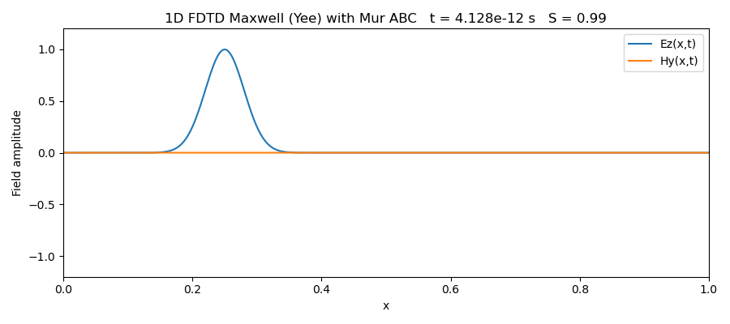

# Electromagnetic Wave Propagation via Finite-Difference Time-Domain (FDTD)

This project implements finite-difference time-domain (FDTD) solvers for
Maxwell's equations in one and two spatial dimensions. The simulations
demonstrate time-domain electromagnetic wave propagation, numerical stability
via Courant conditions, and diffraction from a single slit.

The discretization follows the standard Yee staggered grid, with electric and
magnetic field components defined at interleaved spatial locations and evolved
using leapfrog time stepping.

-----------------------------------------------------------------------

## Governing Equations

In free space, Maxwell's curl equations are

    dB/dt = - curl(E)
    dE/dt = c^2 curl(B)

In one dimension (propagation along x, transverse fields), these reduce to

    dEz/dt = (1/eps0) dHy/dx
    dHy/dt = (1/mu0)  dEz/dx

In two dimensions (TEz polarization), the nonzero field components satisfy

    dEz/dt = (1/eps0) ( dHy/dx - dHx/dy )
    dHx/dt = -(1/mu0) dEz/dy
    dHy/dt =  (1/mu0) dEz/dx

-----------------------------------------------------------------------

## Numerical Method

Spatial derivatives are approximated using centered finite differences on a
staggered Yee grid. Time integration is performed using a leapfrog scheme, with
electric and magnetic fields offset by half a time step.

For example, in one dimension the update equations are

    Hy^{n+1/2}(i+1/2) =
        Hy^{n-1/2}(i+1/2)
        - (dt/(mu0 dx)) [ Ez^n(i+1) - Ez^n(i) ]

    Ez^{n+1}(i) =
        Ez^n(i)
        - (dt/(eps0 dx)) [ Hy^{n+1/2}(i+1/2) - Hy^{n+1/2}(i-1/2) ]

Analogous expressions are used in two dimensions for the TEz system.

-----------------------------------------------------------------------

## Stability (Courant Condition)

Stability of the explicit FDTD scheme requires the time step to satisfy a
Courant-Friedrichs-Lewy (CFL) condition.

In one dimension:

    dt <= dx / c

In two dimensions:

    dt <= 1 / ( c * sqrt( 1/dx^2 + 1/dy^2 ) )

All simulations use dt chosen slightly below the Courant limit. Violating this
condition leads to numerical instability and exponential growth of the fields.

-----------------------------------------------------------------------

## Boundary Conditions

To minimize nonphysical reflections at the edges of the computational domain,
simple absorbing boundary treatments are used. In one dimension, a first-order
Mur absorbing boundary is applied. In two dimensions, a smooth damping layer
(sponge region) attenuates outgoing waves near the boundaries.

-----------------------------------------------------------------------

## Simulations

### One-Dimensional Wave Propagation

A localized Gaussian electric field pulse propagates along a one-dimensional
domain, with electric and magnetic fields evolving according to the FDTD
discretization with boundaries as perfect reflectors.

-----------------------------------------------------------------------

### Two-Dimensional Wave Propagation

In two dimensions, a localized source generates circular wavefronts that
propagate isotropically in the plane, illustrating the full 2D Maxwell dynamics
in TEz polarization.

-----------------------------------------------------------------------

### Single-Slit Diffraction

A perfectly conducting screen with a single slit is introduced by enforcing
Ez = 0 inside the conductor. A time-harmonic incident wave passes through the
slit and produces a diffracted field pattern beyond the aperture, demonstrating
wave interference and diffraction as predicted by Maxwell's equations.

